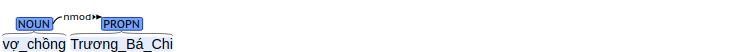
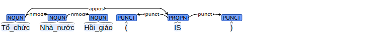

# Cụm danh từ

UD cho rằng cụm danh từ là một trong những thành cơ bản chúng ta có thể tìm trong mọi ngôn ngữ. Một cụm danh từ cơ bản chứa 
một danh từ, một danh từ riêng hoặc một đại từ

### Phụ thuộc bổ sung

Một nominal head không chứa core argument mà liên hệ với các modifiers khác: 

1. Một `nmod` là một cụm danh từ bổ nghĩa cho một cụm danh từ khác.
2. Một `appos` là một cụm danh từ theo sau head của một cụm danh từ khác và đứng trong quan hệ đồng tham chiếu hoặc tương đương với nó.
3. Một `amod` là một tính từ bổ nghĩa cho một cụm danh từ khác.

Tham khảo

* https://universaldependencies.org/u/overview/nominal-syntax.html